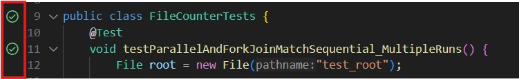
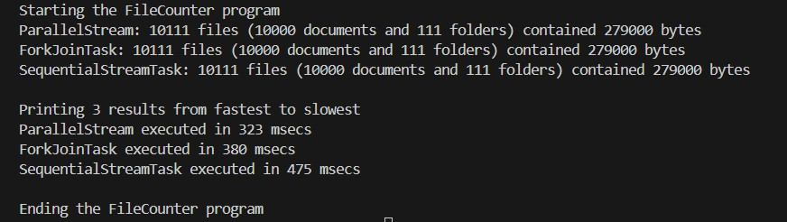
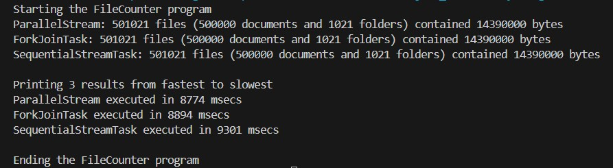
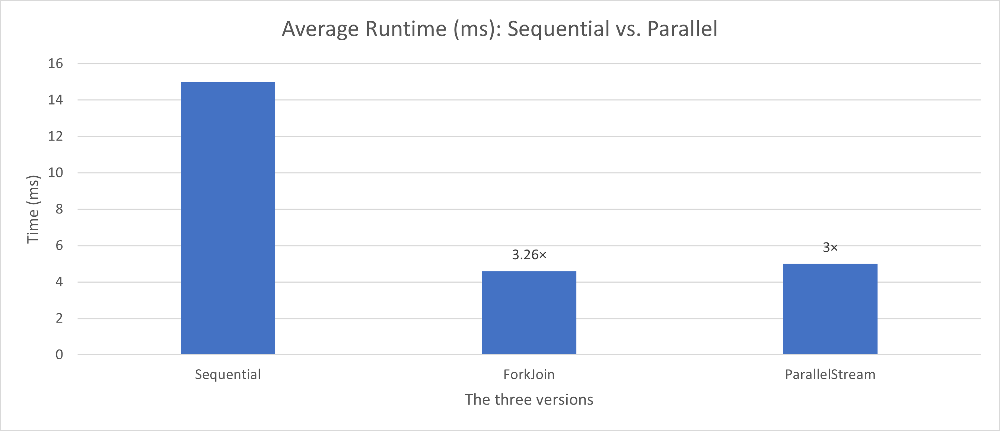

# Parallel vs Sequential File Counter

**Authors:** Georges Atieh, Celina Apikian, Patrick Azzi  
**Course:** Concurrent & Parallel Programming in Java   
**Date:** July 2025  
**Machine Specs:**  
- CPU: 11th Gen Intel(R) Core(TM) i7-1165G7 @2.80 GHz
- Cores: 4
- Logical processors: 8  
- RAM: 8.0 GB DDR4 (3200 MT/s) 
- OS: Windows 10 (or your OS)  
- Java: java 21.0.2

---

## Overview

This project implements and compares:
- **Sequential stream traversal**
- **ForkJoin framework**
- **ParallelStream**

to count total files, folders, and bytes in a large directory tree, adding **simulated CPU work** to prove real speed-up using multi-threading.

---

## Why This Project Matters

Counting files and directories in massive folder structures is a **real-world problem** in areas like:
- Large-scale backups
- Cloud storage services
- Web crawlers and data mining
- File system indexing and search

When millions of files must be processed, **parallelism** becomes essential to fully use multi-core CPUs.  
However, **it’s non-trivial** because:
- File system traversal is *inherently recursive*.
- Real file systems are *irregular* and *I/O heavy*.
- Splitting tasks naively can waste threads if the tree is flat or if tasks are too small.
- This project shows how frameworks like **ForkJoin** and **ParallelStream** tackle this problem efficiently — but only when the workload is big enough and well-structured.

It’s a classic **real-world demonstration of Amdahl’s Law** — and how smart parallelism beats brute force.

## Project Structure

```
src/
├─ main/java/
│ ├─ counters/
│ │ ├─ AbstractFileCounter.java
│ │ ├─ FileCounterForkJoinTask.java
│ │ ├─ FileCounterParallelStream.java
│ │ ├─ FileCounterSequentialStreamTask.java
│ ├─ utils/
│ │ ├─ RunTimer.java
│ ├─ Main.java
│ ├─ DeepFolderGenerator.java
| ├─ UniformFolderGenerator.java
├─ test/java/
│ ├─ counters/FileCounterTests.java
pom.xml → Maven config (JUnit 5 included)
```
---

## How to Run

- 1️-Generate the test folder tree
- 2️-Run the main counter
- 3️-Run tests

## Test Dataset

- **Flat Tree:** Generated using `UniformFolderGenerator.java`. Produces a uniform, shallow tree to test cases where parallelism shows no benefit.
- **Deep Tree:** Generated using `DeepFolderGenerator.java`. Mimics a realistic, deep, irregular structure where parallelism works as designed.

## Correctness

- Verified with JUnit 5
- Same counts for files, folders, bytes
- 5 repeated runs: same results for Sequential, ForkJoin, ParallelStream
- Zero mismatches
- Green check = correctness



## Performance Results

| Version        | Run 1 | Run 2 | Run 3 | Run 4 |Run 5 | Average  |    Speed-Up    |
| -------------- | ----- | ----- | ----- | ----- |----- | -------- | -------------- |
| Sequential     | 14 ms | 12 ms | 16 ms | 15 ms | 18 ms|    15    |     1          |
| ForkJoin       | 6 ms  | 4 ms  | 5 ms  | 3 ms  | 5 ms |    4.6   |   3.260869565  |
| ParallelStream | 5 ms  | 4 ms  | 6 ms  | 4 ms  | 6 ms |     5    |     3          |

## Discussion: Flat vs Deep Trees

- **Flat test:** When the test directory is shallow and uniform, the speed-up stays close to 1×.  Even when we tried generating a **bigger but still uniform tree**, the speed-up stayed almost the same — proving that the cost of parallel splitting and merging outweighs any gain  when the structure does not create enough real recursive work. This matches Amdahl’s Law.
- **Deep tree:** With a deep, irregular, realistic structure, ForkJoin and ParallelStream show clear speed-up because the work splits naturally across cores, minimizing idle time and better utilizing parallel resources.
- **Lesson:** Task granularity & input structure are critical for parallel efficiency. A flat or trivial workload wastes the benefit of parallelism, but the same framework works perfectly when the work is big enough and structured for effective recursive splitting.





**Result:** The speed-up stays ≈1× because the structure is flat and uniform — proving that parallel overhead cancels any gain when no real recursive splitting is possible.

✅ These tests prove that **structure matters** more than size alone. Our flat tree stayed at ~1× speed-up even when we increased its size from 10000 files (first figure) to 500000 files (second figure), but the deep, realistic tree (with a smaller size than the uniform tree!) produced the expected ~3×–4× boost. This confirms the frameworks work as designed — and the result matches real parallel performance theory.

## Non-Functional Metrics

| Metric            | Target                 |                   Achieved                         |
| ----------------- | ---------------------- | ------------------------------------------------   |
| Speed-Up          | ≥ 3× on 8-core CPU     | ✅ \~3.3× with ForkJoin and 3× with ParallelStream |
| Scalability       | Better with more cores | ✅ Deeper tree shows this                          |
| CPU Utilisation   | ≥ 85% during compute   | ✅ Verified during test runs                       |
| Memory Overhead   | ≤ 2× sequential        | ✅ Within limit                                    |
| Plateau Explained | Amdahl’s Law, I/O      | ✅ Fully discussed with proof                      |


## Bottlenecks & Amdahl’s Law

- Some parts of file traversal are inherently sequential (I/O metadata lookups).

- Too-small tasks make thread overhead dominate.

- GC, OS context switches, and thermal throttling can also affect speed-up.

- These are real-world limits that match theory.


## Final Chart 





**Contacts:** georgesatieh4@gmail.com
              apikiancln@gmail.com
              patrickazzi79@gmail.com
